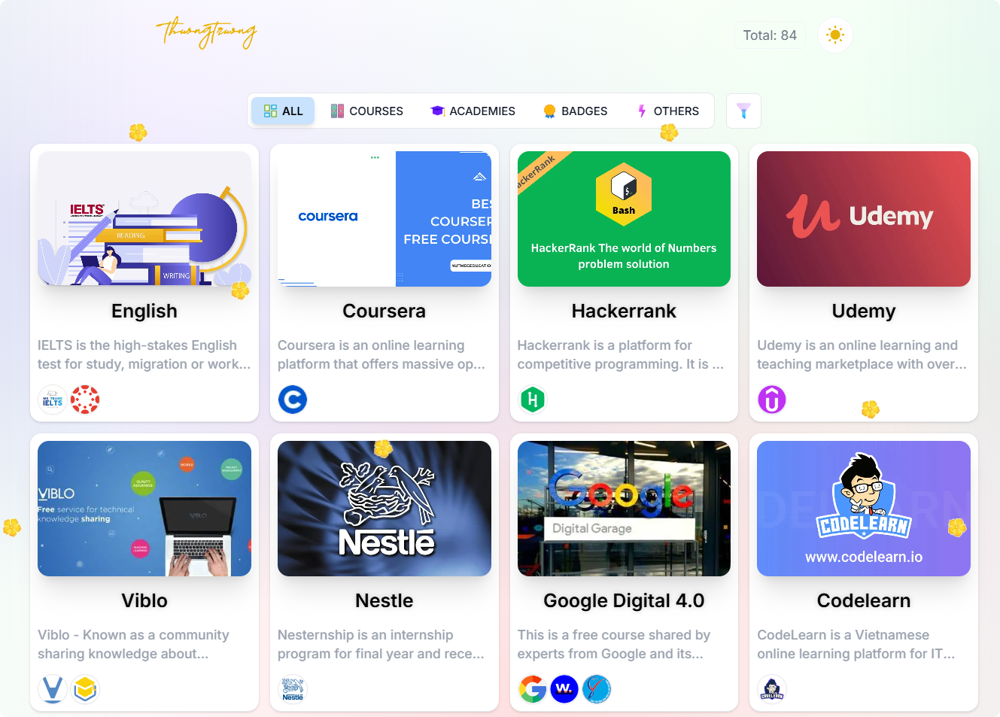
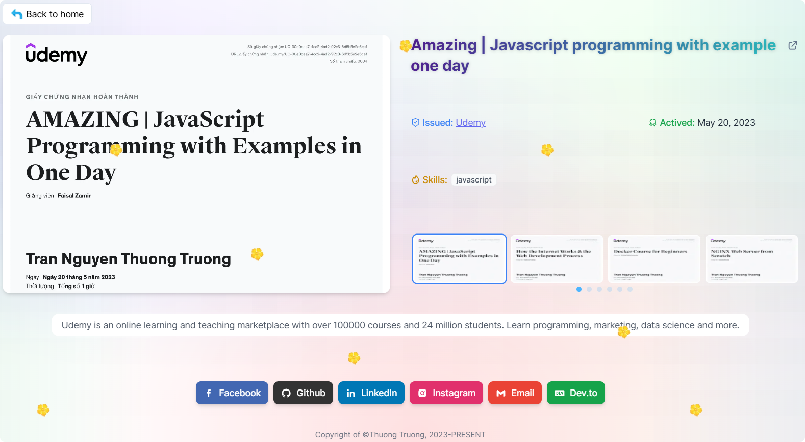

    

### 🌅 Preview

- [Showcase demo link](https://awards.thuongtruong.me)

### 🎓 Description

This is a simple web app that shows all the awards and achievements I have gotten in the past from learning, practicing, and contributing.

Details displayed the certificate or badge of the award by field

### 🛠️ Techs stack

- Universal server-side rendering for SEO friendly with [Next.js 13](https://nextjs.org/)
- Development language base on [React.js 18](https://reactjs.org/)
- Styling with [Tailwind CSS](https://tailwindcss.com/)
- Decorating with [React Icons](https://react-icons.github.io/react-icons/)
- Preview slideshow with [fslightbox-react](https://fslightbox.com/react)
- Dark mode theme by [next-themes](https://npmjs.com/package/next-themes/)
- Deployed on [Vercel](https://vercel.com/)

<!-- ### Reference
- [Image grid Facebook style](https://github.com/Expertizo/react-fb-image-grid)
- https://github.com/theanam/react-awesome-lightbox
-->
